<div align="center">

[中文](./README.zh.md) · **English**

# 🎨 Design Style Skill

---

**Pick and apply a design style from 67 curated aesthetics — in 3 steps.**

[](./LICENSE)
[]()
[](https://github.com/yanliudesign/design-style-skill/stargazers)

[](https://claude.ai/code)
[]()
[]()
[]()
[]()

</div>

> 🧪 Interactive lab: browse all **67 styles** — colors, CSS, prompt templates — at **[design-lab-yanliu.vercel.app](https://design-lab-yanliu.vercel.app/)**.

An agent skill for picking a design style. Tell it what you're building and the feeling you want, and it hands back **3 opinionated recommendations** — each with a real color palette, ready-to-paste CSS variables, font suggestions, and a prompt template. Pick one, and it integrates the style into your existing code (Tailwind, vanilla CSS, styled-components, plain HTML). Not a moodboard, not 15 vague options — 3 concrete choices you can ship today.

---

## How it works — just 3 steps

Invoke the skill with anything like *"help me pick a design style"* / *"apply glassmorphism to my landing page"* / *"帮我选设计风格"* and you go through exactly:

1. **Tell me the project + vibe** — one question about what you're building (SaaS / portfolio / e-commerce / blog / landing), one about the feeling (professional / bold / warm / minimal). If your first message already covers both, this step is skipped.
2. **Get 3 style recommendations** — each with a one-line reason it fits, a 4-color palette, DNA scores (Roundness / Contrast / Warmth), and a 2-sentence "why this over the others."
3. **Apply it to your code** — pick one, and the skill scans your existing project (Tailwind config? CSS variables? styled-components?) and injects the palette / fonts / radii / shadows *in your project's own idiom*, plus a Google Fonts / Fontshare `<link>` and a sample styled component (card / button / nav) to sanity-check.

Three side entrances exist:

- **Lookup mode** — *"tell me about glassmorphism"* skips straight to Phase 3 and shows the full style card.
- **Apply-only mode** — *"apply cyberpunk to this file"* skips recommendation and jumps to Phase 4.
- **Direct name mode** — mention a style name in any query and it's treated as the chosen style.

---

## The 67 styles at a glance

The full library — every style has color palette, DNA scores, prompt templates, CSS snippet, do's & don'ts. Click any preview to jump to its full spec in [`styles-reference.md`](./styles-reference.md). Interactive companion at **[design-lab-yanliu.vercel.app](https://design-lab-yanliu.vercel.app/)**.

**Tag legend:** `Easy` `Medium` `Advanced` (difficulty) · `Light` `Dark` `Bold` (mood) · `🔥 Trend` (currently hot)

<!-- Gallery: all 67 styles. Each row = preview + name + description + tags + palette. -->
<table>
<tr>
<td width="260">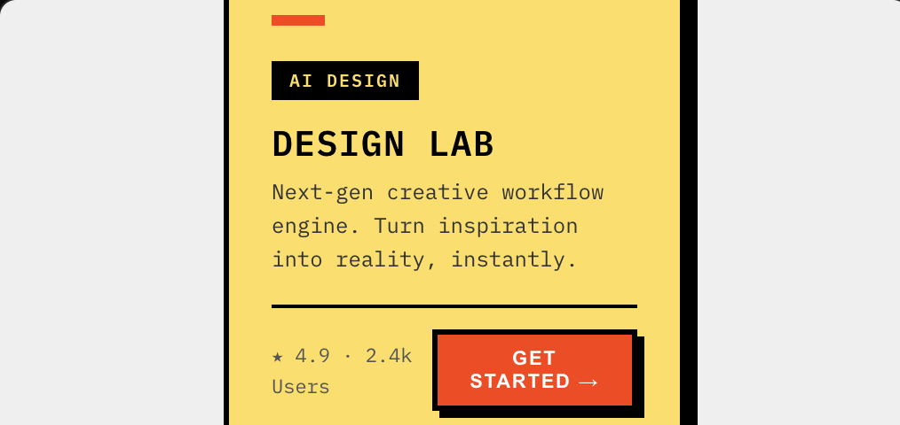</td>
<td>

<strong>01. Brutalism</strong> · <em>粗野主义</em><br>
<sub>Easy · Light</sub>

Raw, bold aesthetic with thick borders, high contrast and intentionally rough design. Great for portfolios and creative studios.

`#000000` `#FFFFFF` `#FF3B00` `#FFDE59`

</td>
</tr>
<tr>
<td width="260">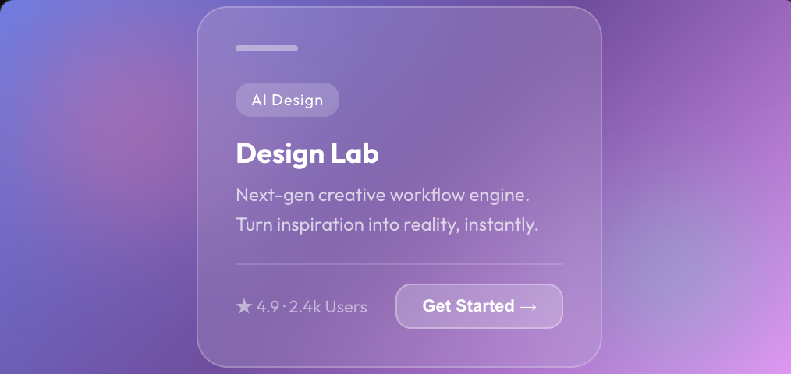</td>
<td>

<strong>02. Glassmorphism</strong> · <em>玻璃拟态</em><br>
<sub>Medium · Light · 🔥 Trend</sub>

Frosted glass effect with transparency and blur. Layers and depth through translucent panels on colorful backgrounds.

`#667eea` `#764ba2` `#f093fb` `#ffffff26`

</td>
</tr>
<tr>
<td width="260">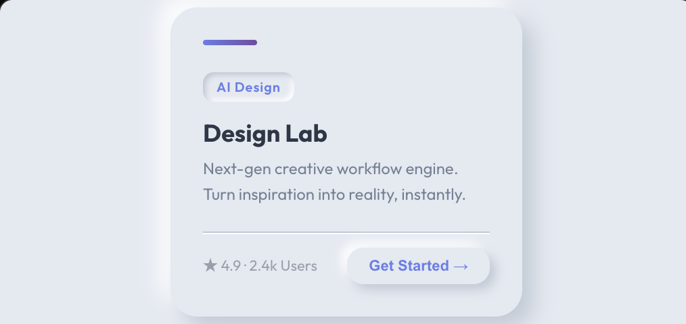</td>
<td>

<strong>03. Neomorphism</strong> · <em>新拟态</em><br>
<sub>Easy · Light</sub>

Soft 3D effect using light and dark shadows on same-colored backgrounds. Tactile, touchable interface feel.

`#E4E9F0` `#BEC8D4` `#FFFFFF` `#667eea`

</td>
</tr>
<tr>
<td width="260">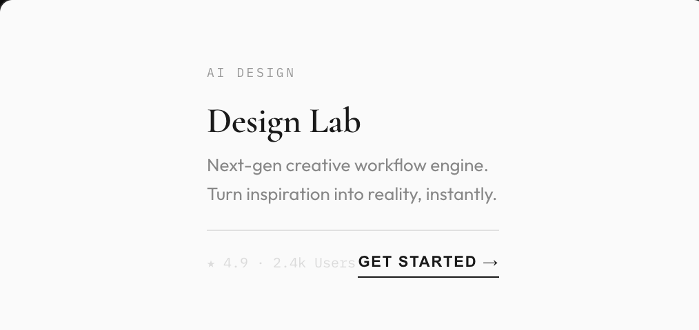</td>
<td>

<strong>04. Minimalism</strong> · <em>极简主义</em><br>
<sub>Medium · Light</sub>

Maximum whitespace, zero decoration. Content breathes. Typography and spacing do all the work.

`#FAFAFA` `#1A1A1A` `#999999` `#E0E0E0`

</td>
</tr>
<tr>
<td width="260">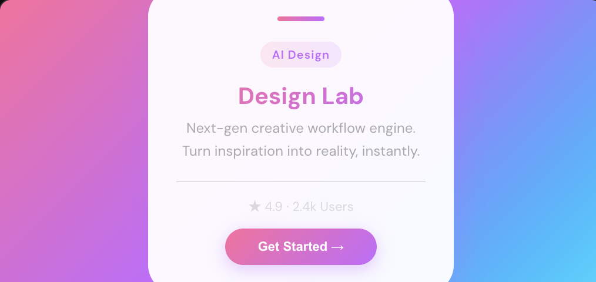</td>
<td>

<strong>05. Retro</strong> · <em>Y2K / 千禧风</em><br>
<sub>Advanced · Light · 🔥 Trend</sub>

Nostalgic 2000s aesthetic with candy gradients, chrome effects, and bubble shapes. Fun and playful.

`#FF6B9D` `#C66AFF` `#00D4FF` `#FFFFFF`

</td>
</tr>
<tr>
<td width="260">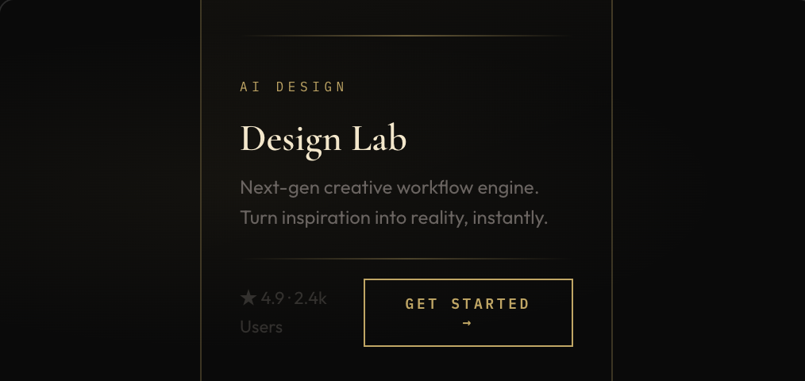</td>
<td>

<strong>06. Dark Luxury</strong> · <em>暗黑奢华</em><br>
<sub>Medium · Dark</sub>

Dark backgrounds with gold accents, serif typography, and refined spacing. Premium and exclusive.

`#0A0A0A` `#C5A55A` `#F5E6C8` `#1A1A1A`

</td>
</tr>
<tr>
<td width="260">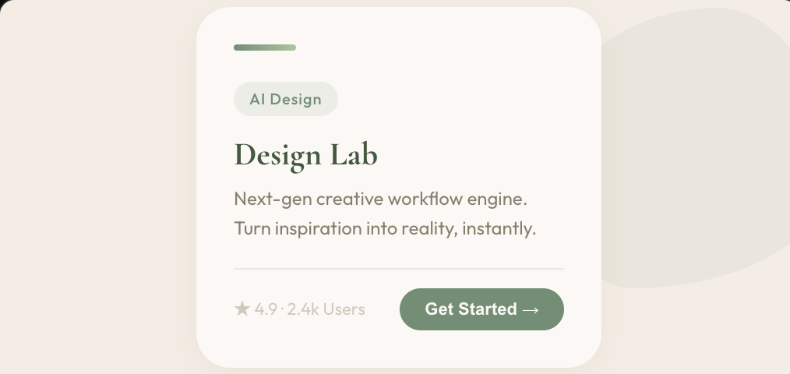</td>
<td>

<strong>07. Organic</strong> · <em>Nature / 有机自然</em><br>
<sub>Medium · Light</sub>

Earthy tones, rounded shapes, and natural textures. Warm and approachable nature-inspired design.

`#F4EDE4` `#6B8F71` `#D4A574` `#3D5A3E`

</td>
</tr>
<tr>
<td width="260">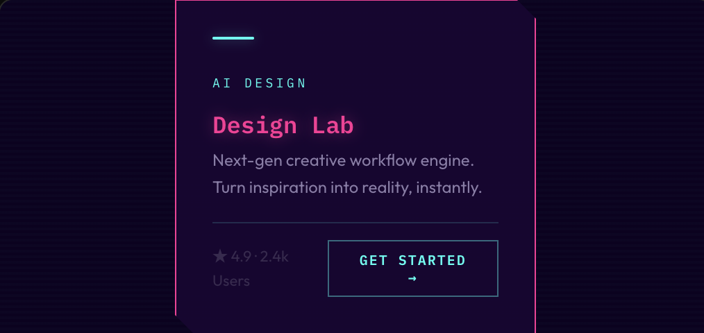</td>
<td>

<strong>08. Cyberpunk</strong> · <em>赛博朋克</em><br>
<sub>Advanced · Dark · 🔥 Trend</sub>

Neon colors on dark backgrounds with glitch effects and futuristic UI patterns. High-tech dystopian.

`#0D0221` `#FF2E97` `#00FFF0` `#1A0533`

</td>
</tr>
<tr>
<td width="260">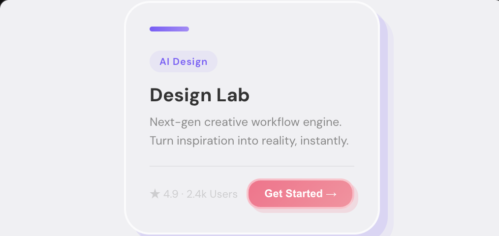</td>
<td>

<strong>09. Claymorphism</strong> · <em>粘土风</em><br>
<sub>Easy · Light · 🔥 Trend</sub>

Soft 3D clay-like appearance with rounded shapes and playful colors. Friendly and approachable.

`#F0F0F3` `#7C5CFC` `#FF6B8A` `#FFB347`

</td>
</tr>
<tr>
<td width="260">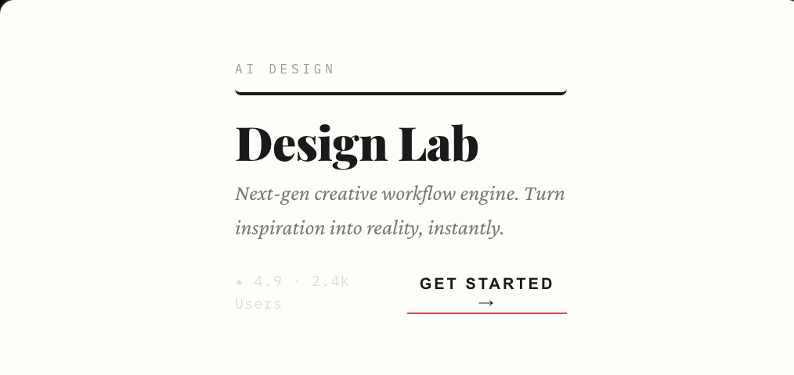</td>
<td>

<strong>10. Editorial</strong> · <em>编辑排版风</em><br>
<sub>Advanced · Light</sub>

Magazine-inspired layout with strong typography hierarchy, grid systems, and refined spacing.

`#FFFDF8` `#1A1A1A` `#E63946` `#999999`

</td>
</tr>
<tr>
<td width="260">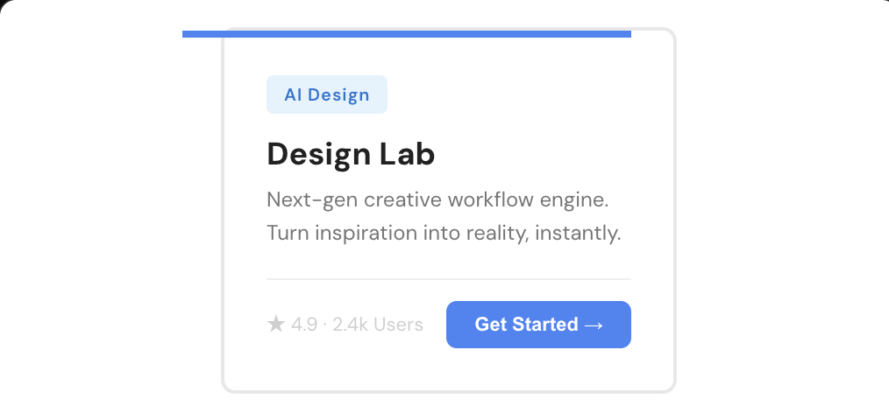</td>
<td>

<strong>11. Flat Design</strong> · <em>扁平设计</em><br>
<sub>Easy · Light</sub>

Clean, simple design with solid colors, no shadows or gradients. Focus on clarity and usability.

`#FFFFFF` `#4285F4` `#E8E8E8` `#212121`

</td>
</tr>
<tr>
<td width="260">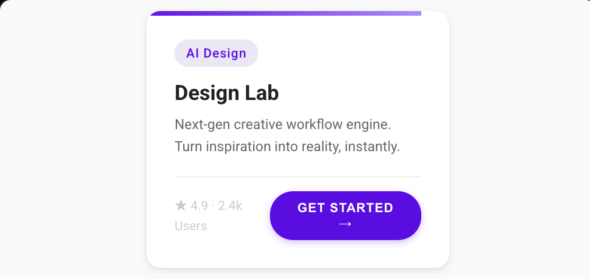</td>
<td>

<strong>12. Material Design</strong> · <em>材质设计</em><br>
<sub>Easy · Light</sub>

Google's design system with elevation shadows, responsive motion, and structured components.

`#FFFFFF` `#6200EA` `#B388FF` `#F0F0F0`

</td>
</tr>
<tr>
<td width="260">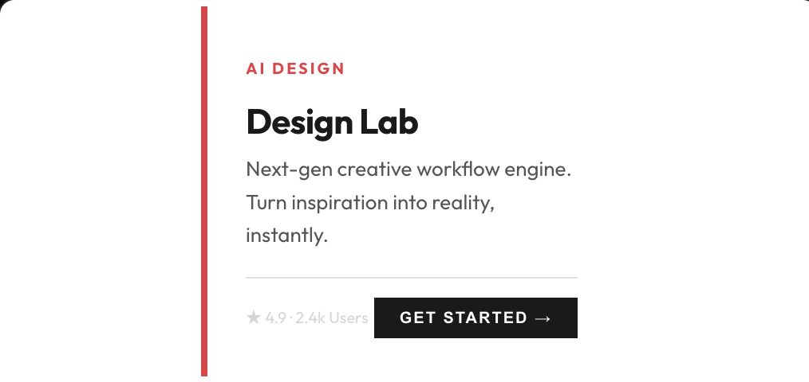</td>
<td>

<strong>13. Swiss Minimalist</strong> · <em>瑞士极简</em><br>
<sub>Medium · Light</sub>

International typographic style with rigid grids, sans-serif fonts, and mathematical precision.

`#FFFFFF` `#1A1A1A` `#E63946` `#E0E0E0`

</td>
</tr>
<tr>
<td width="260">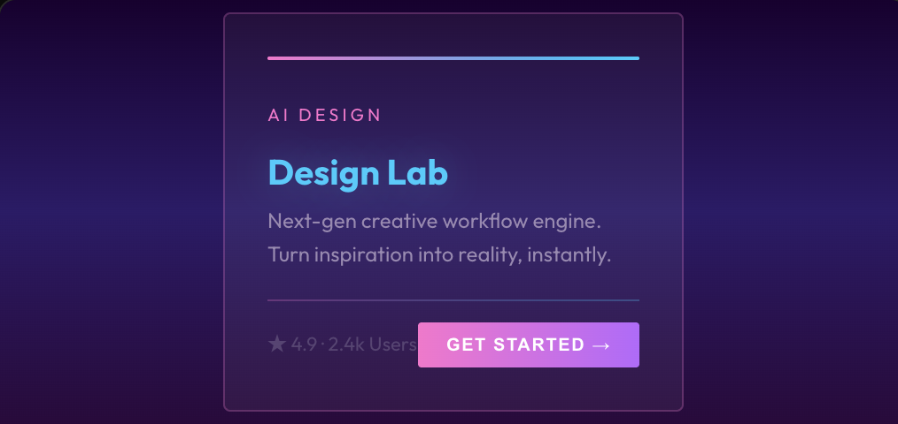</td>
<td>

<strong>14. Vaporwave</strong> · <em>蒸汽波</em><br>
<sub>Advanced · Dark · 🔥 Trend</sub>

Retro-futuristic aesthetic with pink-purple gradients, Greek statues, and 90s computer nostalgia.

`#1a0030` `#FF71CE` `#01CDFE` `#B967FF`

</td>
</tr>
<tr>
<td width="260">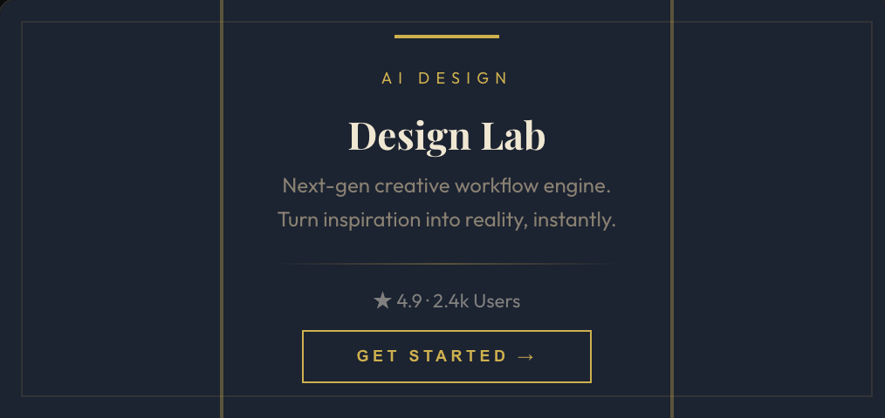</td>
<td>

<strong>15. Art Deco</strong> · <em>装饰艺术</em><br>
<sub>Advanced · Dark</sub>

Geometric patterns, gold accents, symmetrical layouts inspired by 1920s decorative arts movement.

`#1A2332` `#D4AF37` `#F0E6D0` `#E8DCC8`

</td>
</tr>
<tr>
<td width="260">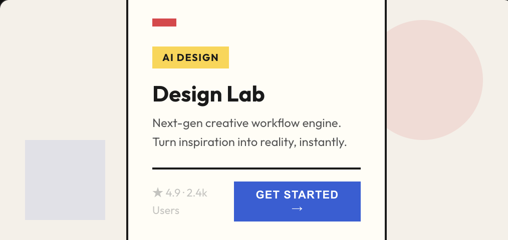</td>
<td>

<strong>16. Bauhaus</strong> · <em>包豪斯</em><br>
<sub>Medium · Light</sub>

Form follows function. Primary colors, geometric shapes, and rational design from the Bauhaus school.

`#F5F0E8` `#E63946` `#2D5FD8` `#FFD43B`

</td>
</tr>
<tr>
<td width="260">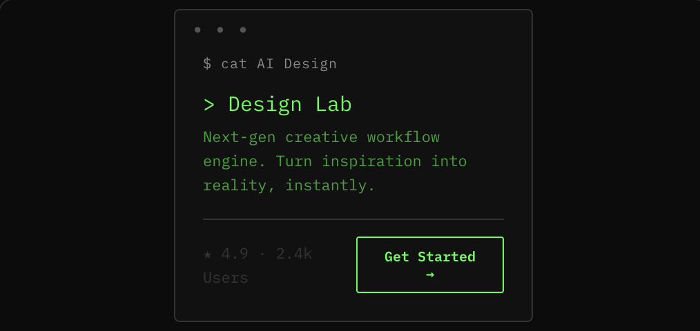</td>
<td>

<strong>17. Terminal</strong> · <em>终端风</em><br>
<sub>Easy · Dark</sub>

Command-line interface aesthetic with monospace fonts, dark backgrounds, and green/amber text.

`#0C0C0C` `#00FF41` `#333333` `#888888`

</td>
</tr>
<tr>
<td width="260">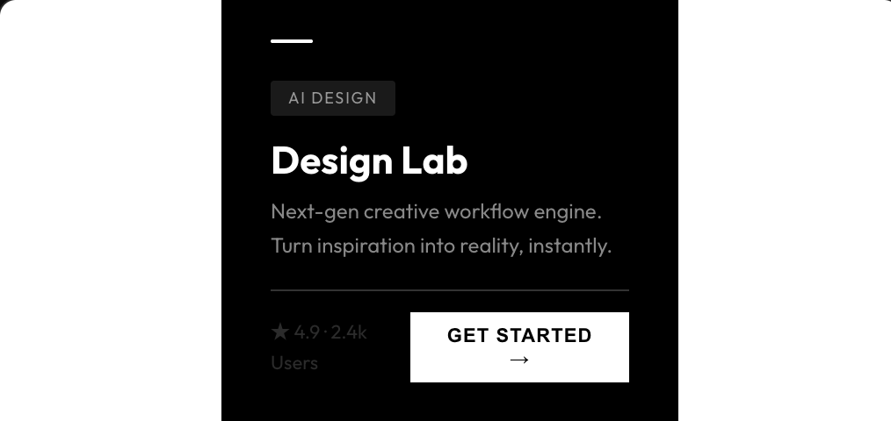</td>
<td>

<strong>18. Monochrome</strong> · <em>单色风</em><br>
<sub>Easy · Dark</sub>

Pure black and white design. Zero color, maximum contrast. Typography and composition are everything.

`#000000` `#FFFFFF` `#888888` `#333333`

</td>
</tr>
<tr>
<td width="260">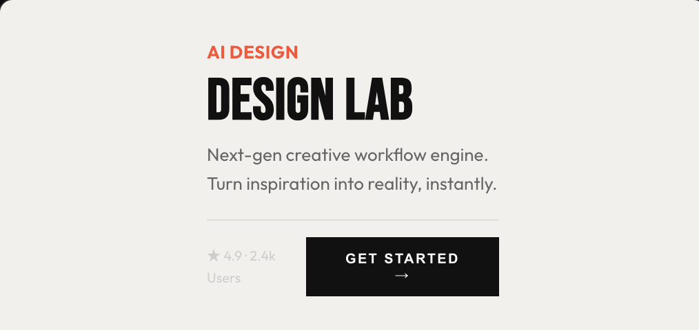</td>
<td>

<strong>19. Bold Typography</strong> · <em>粗体排版</em><br>
<sub>Medium · Light</sub>

Typography as the hero. Oversized headings, extreme weight contrasts, and text-driven layouts.

`#F2F0ED` `#111111` `#FF4D2E` `#666666`

</td>
</tr>
<tr>
<td width="260">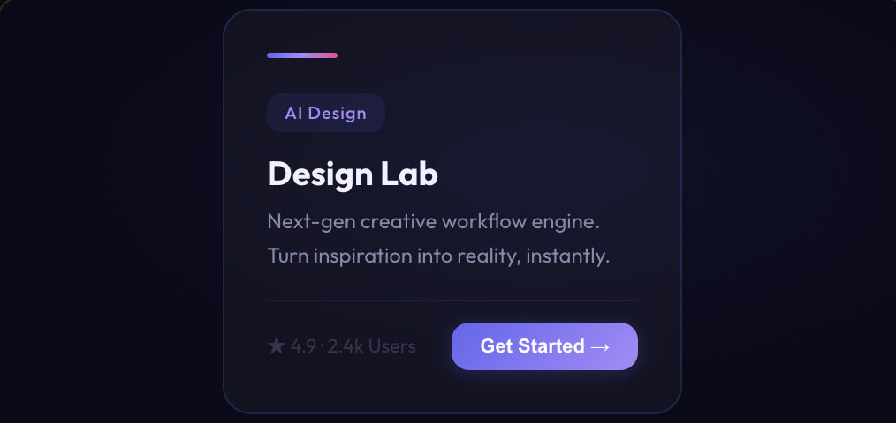</td>
<td>

<strong>20. Web3</strong> · <em>Web3 风</em><br>
<sub>Medium · Dark · 🔥 Trend</sub>

Crypto/DeFi visual language. Dark backgrounds, purple-blue gradients, glow effects, and frosted glass.

`#0A0A1A` `#6366F1` `#A78BFA` `#EC4899`

</td>
</tr>
<tr>
<td width="260">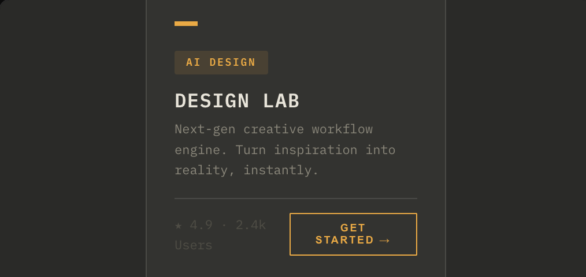</td>
<td>

<strong>21. Industrial</strong> · <em>工业风</em><br>
<sub>Medium · Dark</sub>

Raw, utilitarian aesthetic inspired by factories and machinery. Exposed structure, function-first design.

`#2A2A28` `#F5A623` `#C8C4B8` `#4A4A45`

</td>
</tr>
<tr>
<td width="260">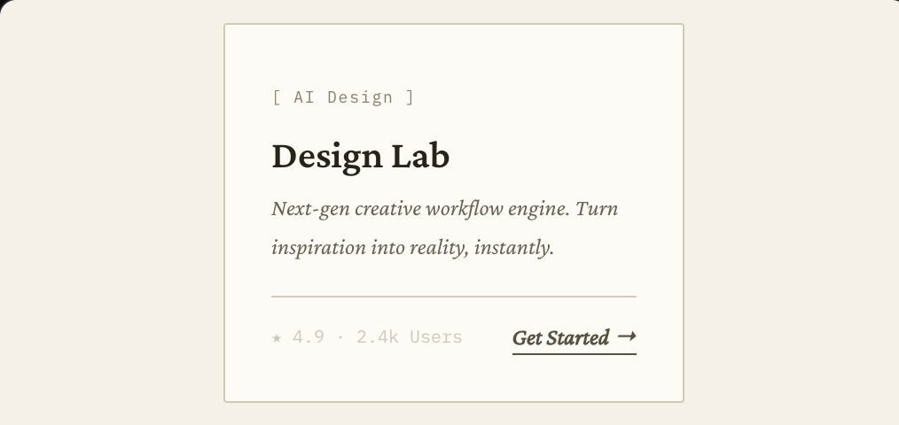</td>
<td>

<strong>22. Academia</strong> · <em>学术风</em><br>
<sub>Easy · Light</sub>

Classic academic style with serif fonts, warm tones, and scholarly gravitas. Intellectual and timeless.

`#F5F1E8` `#3A3428` `#8B7D65` `#D4C9B0`

</td>
</tr>
<tr>
<td width="260"></td>
<td>

<strong>23. SaaS</strong> · <em>SaaS 风格</em><br>
<sub>Easy · Light · 🔥 Trend</sub>

Clean, professional SaaS product design. Trust-building, conversion-focused, with clear CTAs.

`#F8FAFC` `#3B82F6` `#6366F1` `#94A3B8`

</td>
</tr>
<tr>
<td width="260">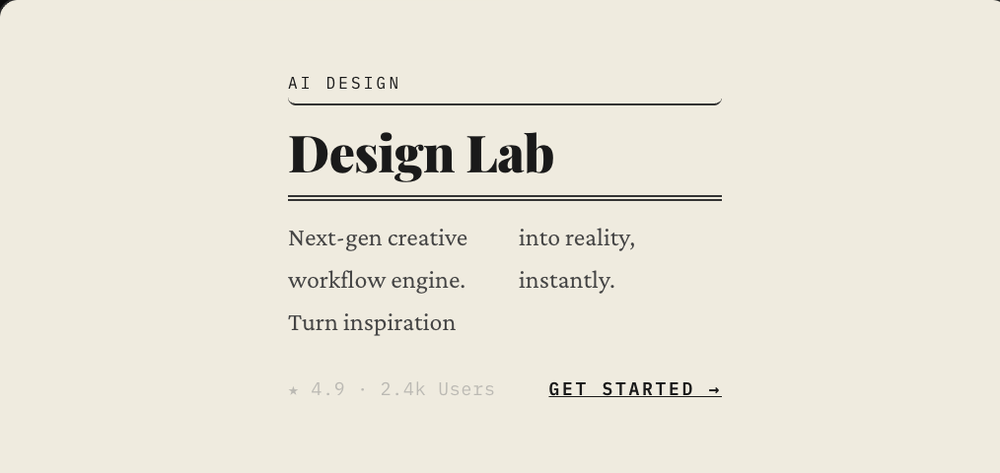</td>
<td>

<strong>24. Newsprint</strong> · <em>报纸风</em><br>
<sub>Medium · Light</sub>

Classic newspaper layout with column grids, serif headlines, and structured content hierarchy.

`#F0EBDD` `#1A1A1A` `#444444` `#888888`

</td>
</tr>
<tr>
<td width="260">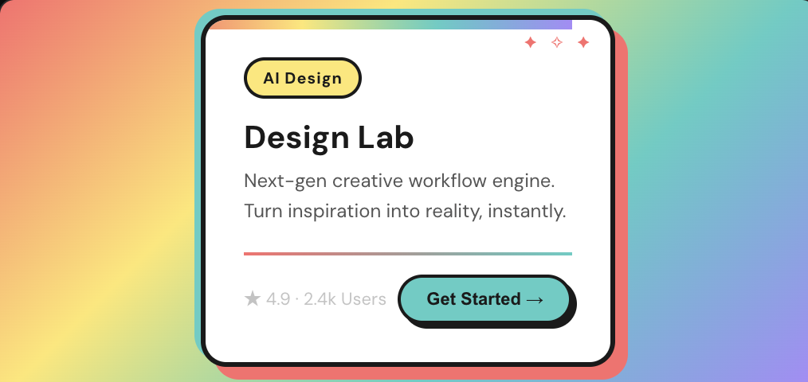</td>
<td>

<strong>25. Maximalism</strong> · <em>极繁主义</em><br>
<sub>Advanced · Light · 🔥 Trend</sub>

More is more. Layer everything—patterns, colors, textures, typography—for maximum visual impact.

`#FF6B6B` `#FFE66D` `#4ECDC4` `#A78BFA`

</td>
</tr>
<tr>
<td width="260">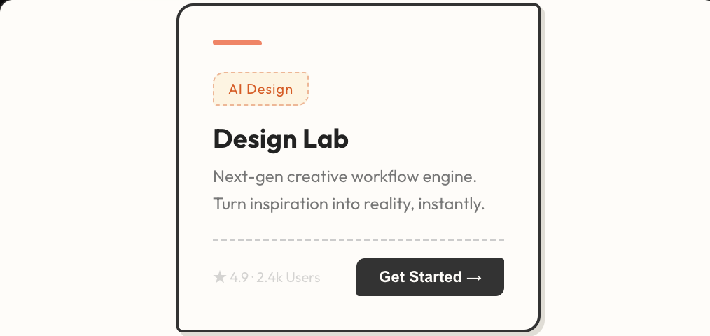</td>
<td>

<strong>26. Sketch</strong> · <em>手绘风</em><br>
<sub>Medium · Light</sub>

Hand-drawn illustration style with organic lines, doodle elements, and friendly, personal feel.

`#FEFCF8` `#333333` `#FF7E5F` `#E0DDD5`

</td>
</tr>
<tr>
<td width="260">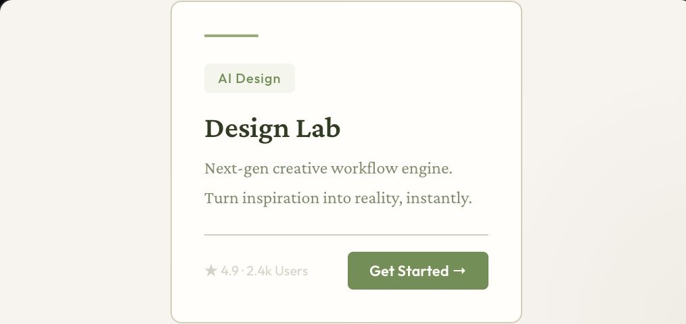</td>
<td>

<strong>27. Botanical</strong> · <em>植物风</em><br>
<sub>Medium · Light</sub>

Plant and nature-inspired design with green tones, leaf motifs, and elegant organic layouts.

`#F7F3EE` `#6B8F4E` `#2E3D20` `#D5CDB8`

</td>
</tr>
<tr>
<td width="260">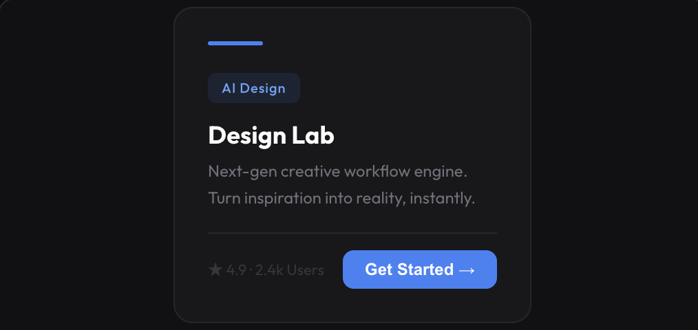</td>
<td>

<strong>28. Modern Dark</strong> · <em>现代暗色</em><br>
<sub>Easy · Dark · 🔥 Trend</sub>

Modern dark UI with subtle gradients, blue accents, and refined glass effects. Developer-favorite aesthetic.

`#111113` `#18181B` `#3B82F6` `#71717A`

</td>
</tr>
<tr>
<td width="260">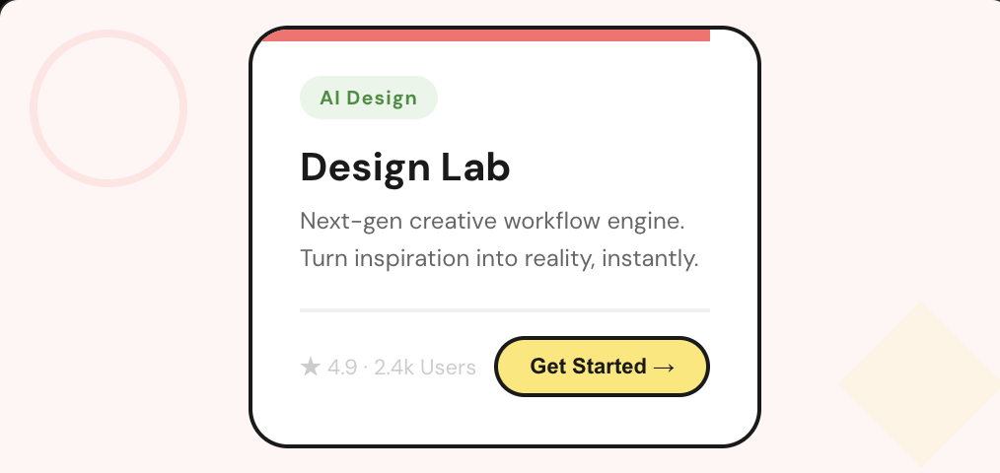</td>
<td>

<strong>29. Playful Geometric</strong> · <em>几何趣味</em><br>
<sub>Medium · Light</sub>

Playful geometric shapes with bold colors, thick borders, and energetic, fun compositions.

`#FFF5F5` `#FF6B6B` `#FFE66D` `#388E3C`

</td>
</tr>
<tr>
<td width="260">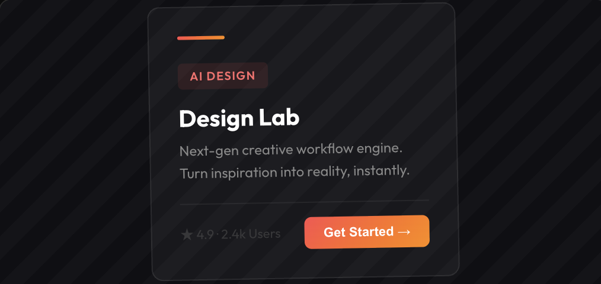</td>
<td>

<strong>30. Kinetic</strong> · <em>动感风</em><br>
<sub>Medium · Dark</sub>

Motion and energy through tilted elements, diagonal compositions, and warm dynamic gradients.

`#0F0F14` `#FF4D4D` `#FF8C00` `#E0E0E0`

</td>
</tr>
<tr>
<td width="260">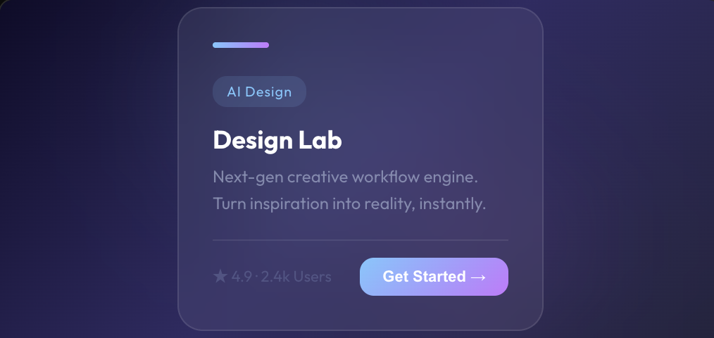</td>
<td>

<strong>31. Aurora</strong> · <em>极光风</em><br>
<sub>Medium · Dark · 🔥 Trend</sub>

Dreamy gradient glows inspired by northern lights. Deep backgrounds with flowing purple-blue-cyan blends.

`#0F0C29` `#302B63` `#78C8FF` `#C878FF`

</td>
</tr>
<tr>
<td width="260">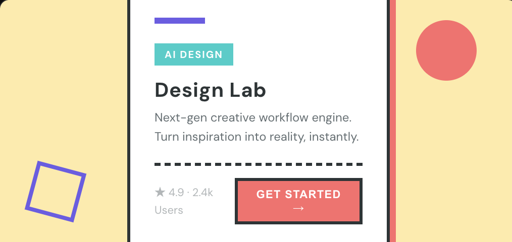</td>
<td>

<strong>32. Memphis</strong> · <em>孟菲斯</em><br>
<sub>Advanced · Light · 🔥 Trend</sub>

Bold 80s Memphis Design Movement. Clashing colors, geometric shapes, squiggles, and offset shadows.

`#FFEAA7` `#FF6B6B` `#6C5CE7` `#00CEC9`

</td>
</tr>
<tr>
<td width="260">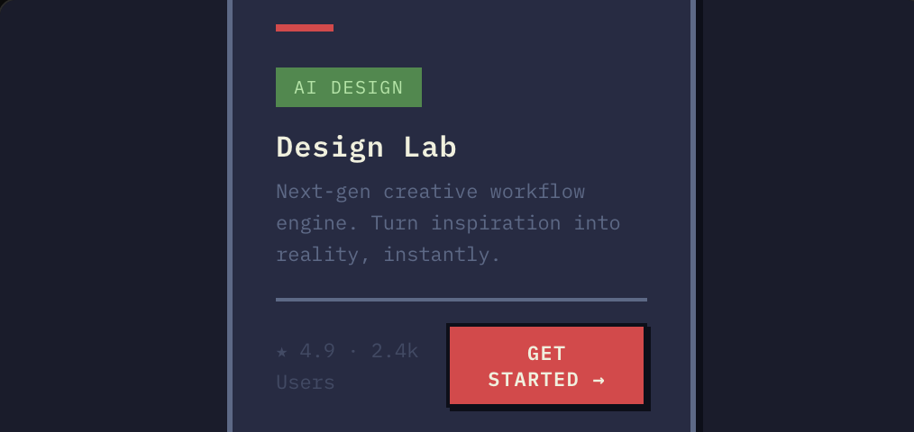</td>
<td>

<strong>33. Pixel Art</strong> · <em>像素风</em><br>
<sub>Medium · Dark</sub>

8-bit pixel art retro gaming aesthetic. Limited palette, no border-radius, monospace fonts.

`#1A1C2C` `#E43B44` `#3E8948` `#F0F0DC`

</td>
</tr>
<tr>
<td width="260">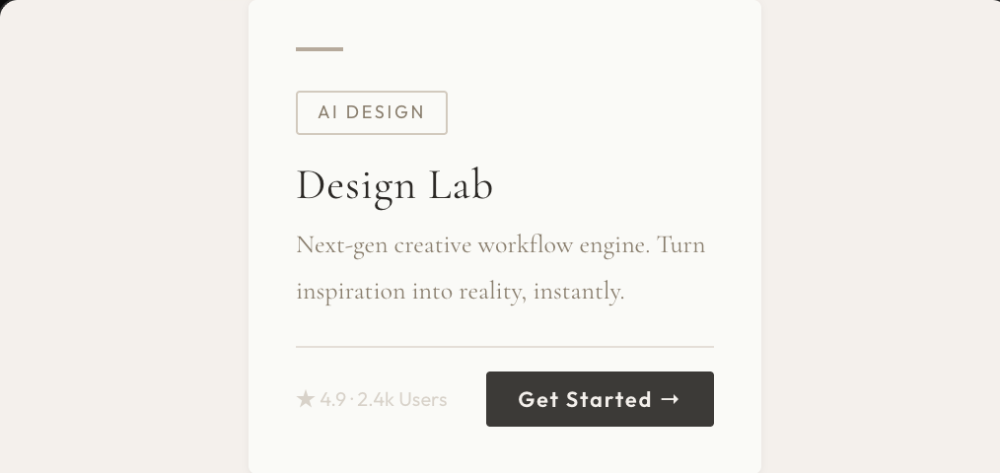</td>
<td>

<strong>34. Japandi</strong> · <em>日式北欧</em><br>
<sub>Medium · Light</sub>

Japanese wabi-sabi meets Scandinavian functionalism. Ultra-restrained earth tones and generous whitespace.

`#F5F0EB` `#B8A99A` `#3C3A36` `#D4C9BC`

</td>
</tr>
<tr>
<td width="260">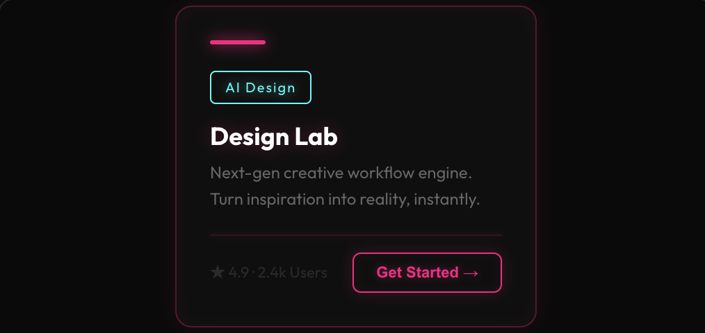</td>
<td>

<strong>35. Neon Glow</strong> · <em>霓虹灯光</em><br>
<sub>Advanced · Dark · 🔥 Trend</sub>

Real neon tube glow effects on pure black. Pink and cyan high-saturation colors with text-shadow halos.

`#0A0A0A` `#FF0080` `#00FFFF` `#E0E0E0`

</td>
</tr>
<tr>
<td width="260">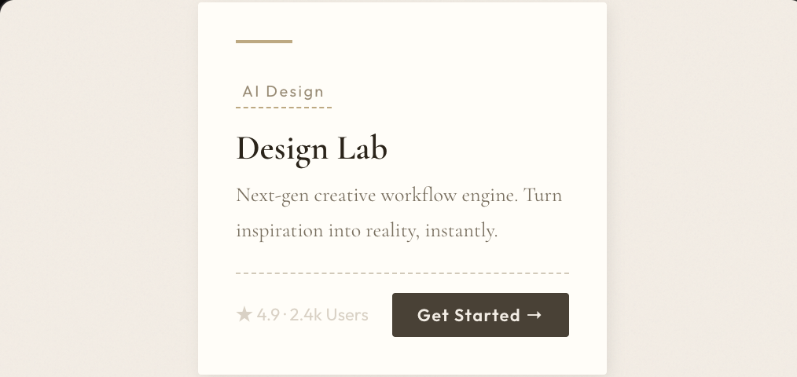</td>
<td>

<strong>36. Paper</strong> · <em>Stationery / 纸质风</em><br>
<sub>Easy · Light</sub>

Paper and stationery texture with warm white, serif fonts, dashed lines, and handcraft warmth.

`#F4EDE4` `#FFFDF7` `#C1A87D` `#4A4035`

</td>
</tr>
<tr>
<td width="260">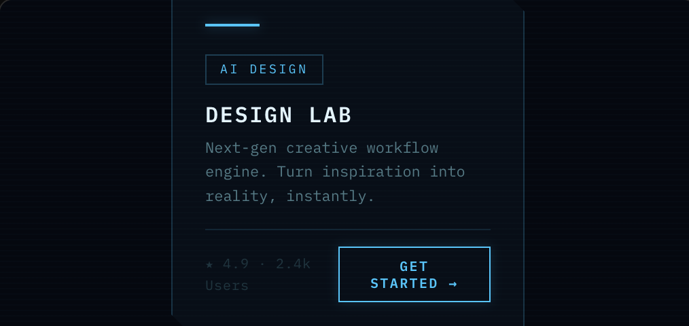</td>
<td>

<strong>37. Sci-Fi HUD</strong> · <em>科幻 HUD</em><br>
<sub>Advanced · Dark</sub>

Sci-fi heads-up display with deep space black, scanlines, clip-path borders, and monospace uppercase.

`#040810` `#00C8FF` `#8CC8D0` `#2A5A65`

</td>
</tr>
<tr>
<td width="260">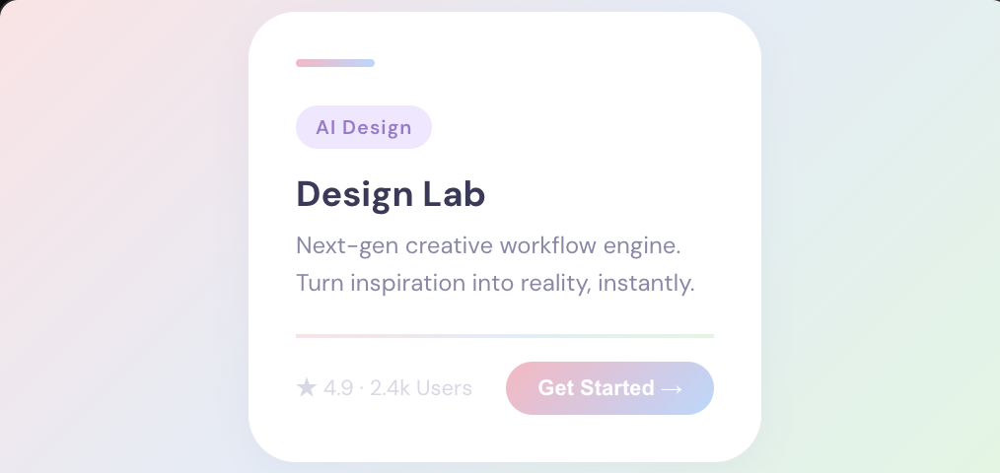</td>
<td>

<strong>38. Pastel Soft</strong> · <em>柔和粉彩</em><br>
<sub>Easy · Light · 🔥 Trend</sub>

Soft candy colors with large rounded corners and gentle colored shadows. Sweet, healing aesthetic.

`#FDE2E4` `#E2ECF6` `#FFB5C2` `#9B7ACC`

</td>
</tr>
<tr>
<td width="260">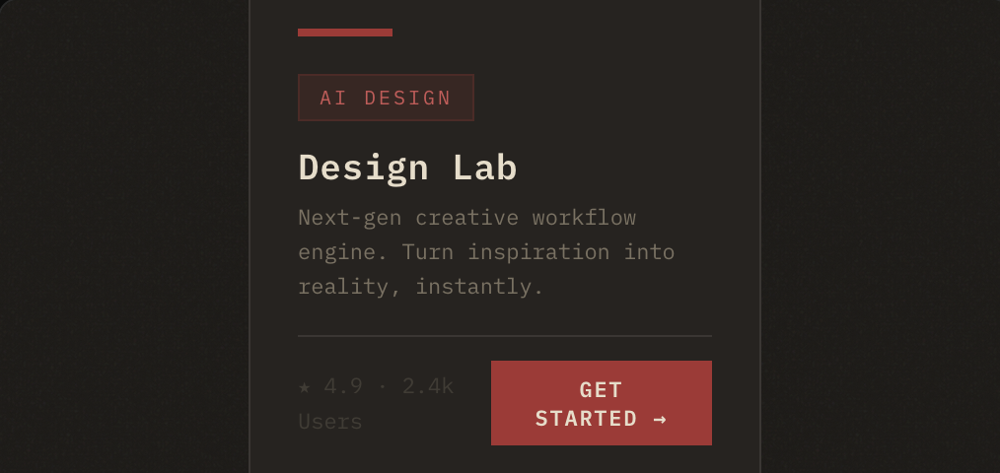</td>
<td>

<strong>39. Grunge</strong> · <em>做旧风</em><br>
<sub>Advanced · Dark</sub>

Rough textures, rust, and distressed effects conveying authenticity and rebellious attitude.

`#1C1A17` `#A83232` `#C4B8A8` `#3A3632`

</td>
</tr>
<tr>
<td width="260">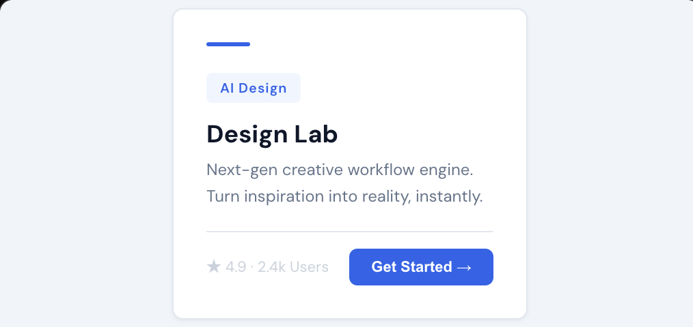</td>
<td>

<strong>40. Corporate</strong> · <em>企业蓝</em><br>
<sub>Easy · Light</sub>

Classic corporate blue-white. Clean, trustworthy, professional. The safe choice for any business product.

`#F0F4F8` `#2563EB` `#0F172A` `#E2E8F0`

</td>
</tr>
<tr>
<td width="260">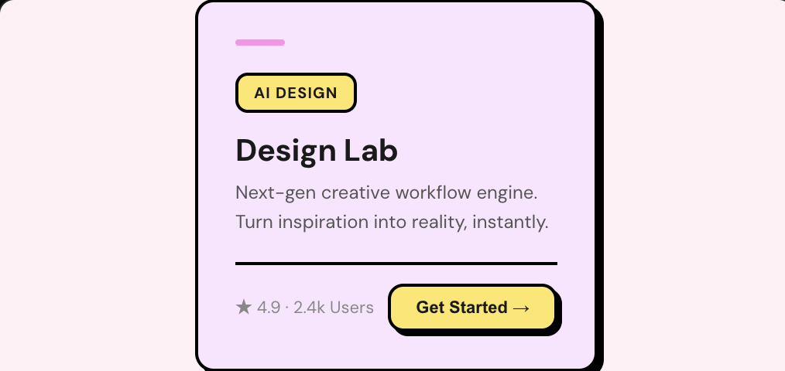</td>
<td>

<strong>41. Neubrutalism</strong> · <em>新粗野主义</em><br>
<sub>Easy · Light · 🔥 Trend</sub>

Bold rebellion against polished digital design — candy colors, thick black borders, hard-edge shadows, and intentional roughness. Fun, irreverent, and impossible to ignore.

`#F9E4FF` `#FFE566` `#FF90E8` `#000000`

</td>
</tr>
<tr>
<td width="260">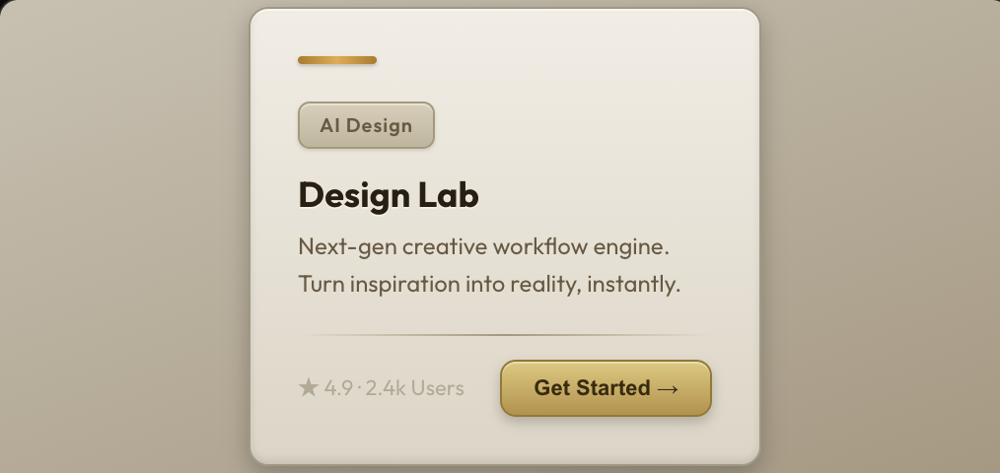</td>
<td>

<strong>42. Skeuomorphism</strong> · <em>拟物设计</em><br>
<sub>Advanced · Light</sub>

Digital interfaces mimicking real-world materials — leather textures, metal knobs, wooden shelves. The original iPhone UI philosophy brought to the modern web.

`#F2EDE4` `#DDD5C5` `#B07820` `#A09880`

</td>
</tr>
<tr>
<td width="260">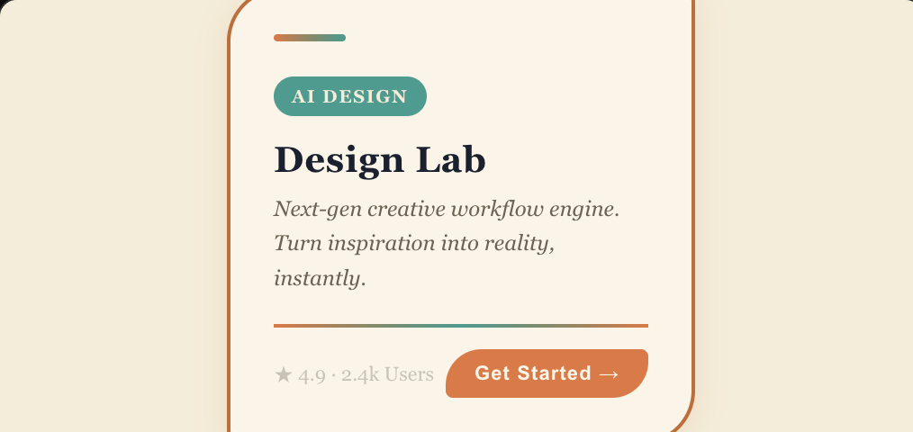</td>
<td>

<strong>43. Retro Futurism</strong> · <em>复古未来主义</em><br>
<sub>Medium · Light</sub>

Imagining the future through a retro lens — rounded CRT screens, warm analog tones, space-age optimism. The future as envisioned in the 1960s-70s.

`#FBF5E6` `#E8743A` `#2A9D8F` `#C66A2E`

</td>
</tr>
<tr>
<td width="260">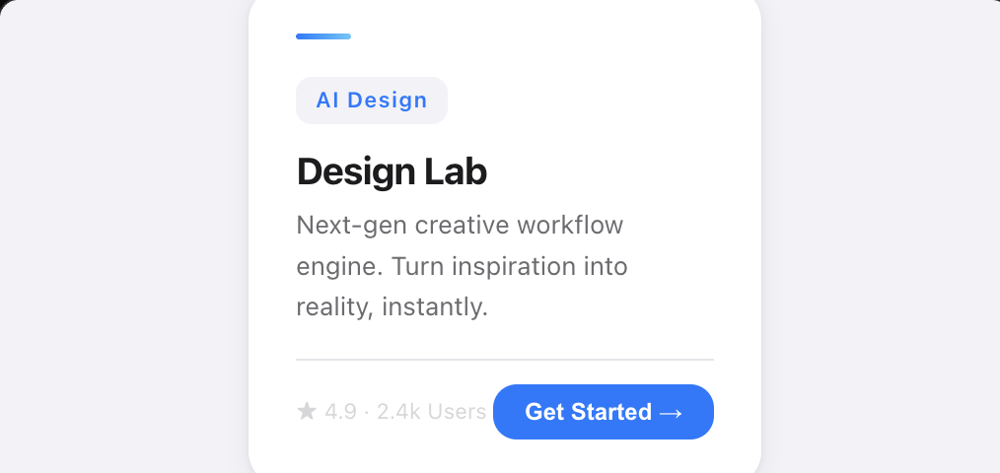</td>
<td>

<strong>44. Bento Box</strong> · <em>便当盒网格</em><br>
<sub>Easy · Light · 🔥 Trend</sub>

Grid-based modular layout inspired by Japanese bento boxes. Each content piece occupies a distinct compartment with consistent gaps and rounded corners.

`#FFFFFF` `#F2F2F7` `#007AFF` `#1C1C1E`

</td>
</tr>
<tr>
<td width="260">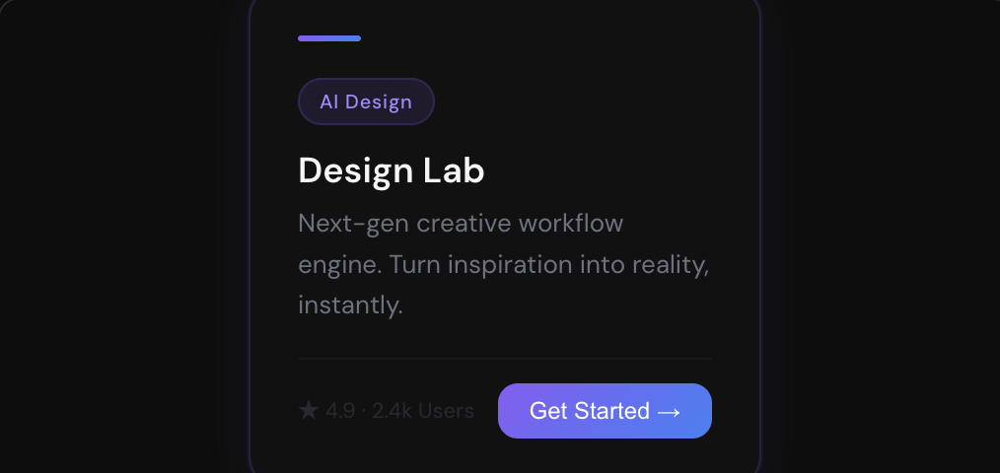</td>
<td>

<strong>45. AI Native UI</strong> · <em>AI原生界面</em><br>
<sub>Medium · Dark · 🔥 Trend</sub>

Design language born from AI products — clean, spacious, conversation-first interfaces with subtle animations and trust-building visual cues.

`#111111` `#8B5CF6` `#3B82F6` `#A78BFA`

</td>
</tr>
<tr>
<td width="260">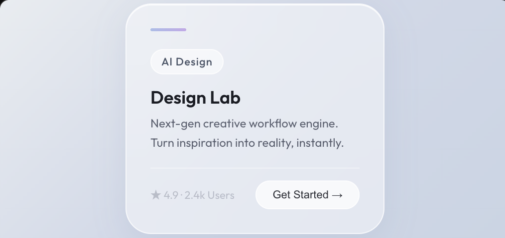</td>
<td>

<strong>46. Liquid Glass</strong> · <em>液态玻璃</em><br>
<sub>Advanced · Light · 🔥 Trend</sub>

Next-gen glassmorphism — liquid-like transparency with real-time reflections, chromatic aberration edges, and fluid morphing animations.

`#E8ECF0` `#FFFFFF73` `#648CDC80` `#A064DC80`

</td>
</tr>
<tr>
<td width="260">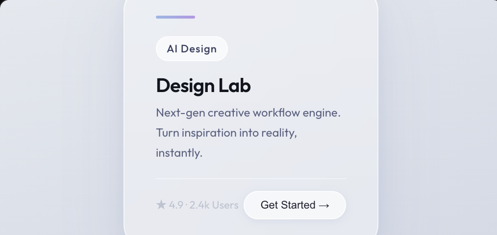</td>
<td>

<strong>47. Spatial UI</strong> · <em>空间界面</em><br>
<sub>Advanced · Light · 🔥 Trend</sub>

Interfaces designed for spatial computing (AR/VR) — floating translucent panels in 3D space with depth, parallax, and hand-gesture affordances.

`#E4E8EE` `#FFFFFF59` `#508CDC8C` `#8C50DC8C`

</td>
</tr>
<tr>
<td width="260">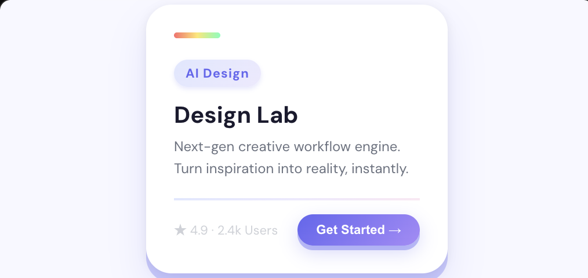</td>
<td>

<strong>48. 3D Hyperrealism</strong> · <em>3D超写实</em><br>
<sub>Medium · Light · 🔥 Trend</sub>

Hyper-realistic 3D rendered elements integrated into web design — glossy materials, dramatic lighting, and volumetric objects floating in UI.

`#FFFFFF` `#6366F1` `#FF6B6B` `#FFE66D`

</td>
</tr>
<tr>
<td width="260">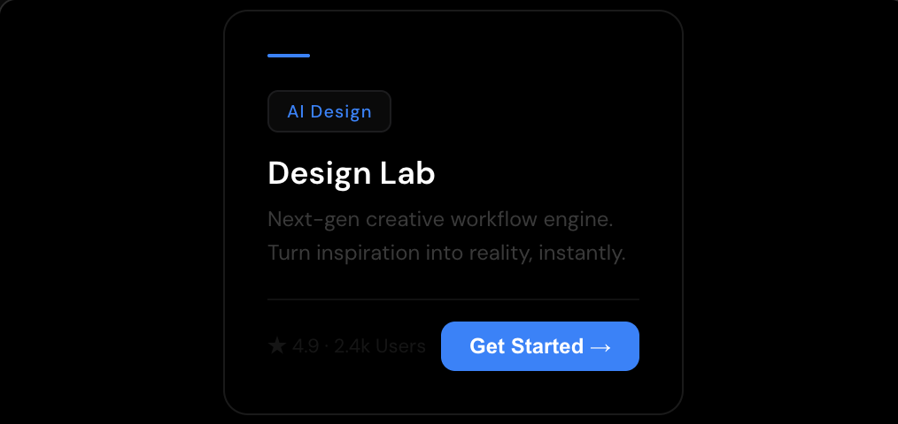</td>
<td>

<strong>49. OLED Dark</strong> · <em>OLED纯黑</em><br>
<sub>Easy · Dark</sub>

Pure black backgrounds (#000) designed for OLED screens — pixels-off black, vibrant accent colors, and high-contrast minimal elements.

`#000000` `#FFFFFF` `#0A84FF` `#1C1C1E`

</td>
</tr>
<tr>
<td width="260">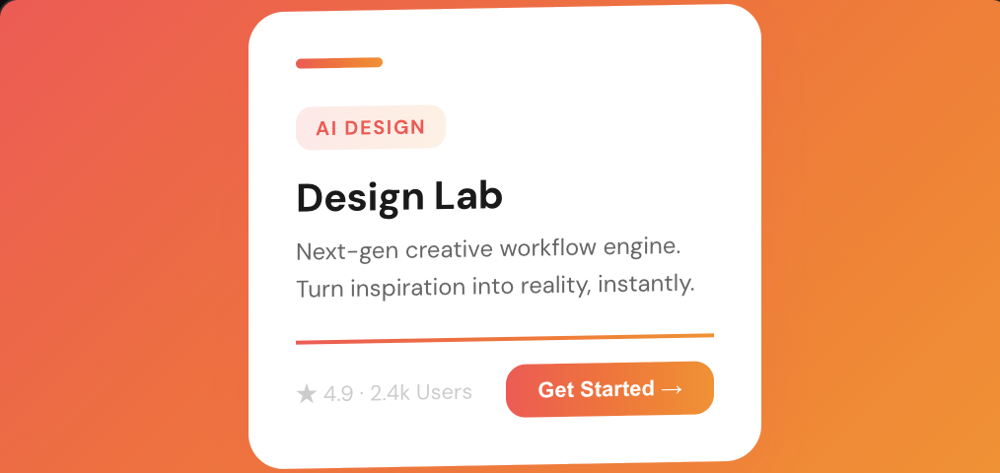</td>
<td>

<strong>50. Motion Driven</strong> · <em>动效驱动</em><br>
<sub>Medium · Light · 🔥 Trend</sub>

Motion as a core design principle — every transition, every state change, every scroll event triggers purposeful, choreographed animations.

`#FFFFFF` `#FF4D4D` `#FF8C00` `#1A1A1A`

</td>
</tr>
<tr>
<td width="260">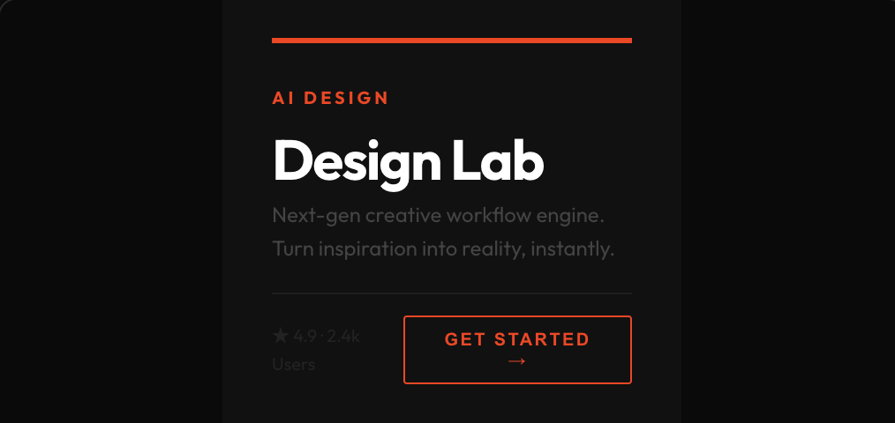</td>
<td>

<strong>51. Kinetic Typography</strong> · <em>动态字体</em><br>
<sub>Advanced · Dark</sub>

Typography in motion — letters that split, morph, bounce, and dance. The typeface IS the animation, creating mesmerizing text-based experiences.

`#111111` `#FFFFFF` `#FF3300` `#333333`

</td>
</tr>
<tr>
<td width="260">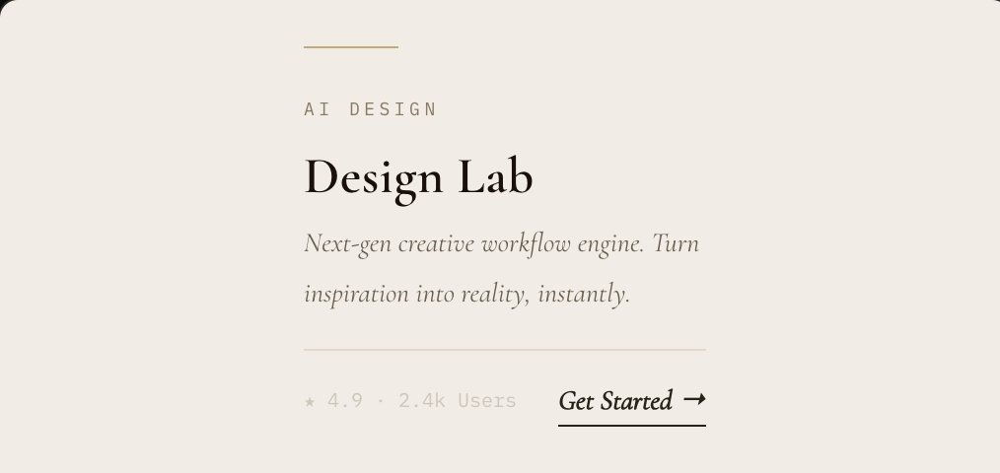</td>
<td>

<strong>52. Parallax Storytelling</strong> · <em>视差叙事</em><br>
<sub>Medium · Light</sub>

Multi-layered scrolling storytelling — foreground and background move at different speeds creating cinematic depth and narrative-driven experiences.

`#F2ECE4` `#C8A87A` `#2A2218` `#8A7A60`

</td>
</tr>
<tr>
<td width="260">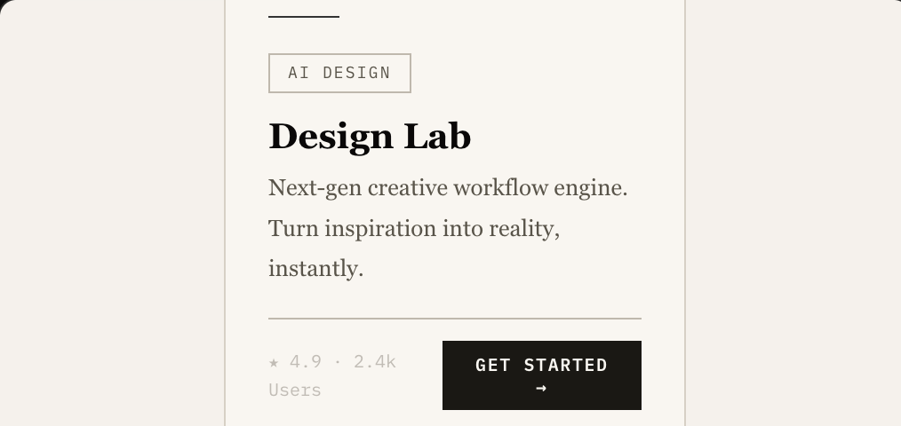</td>
<td>

<strong>53. E-Ink Digital</strong> · <em>电子墨水</em><br>
<sub>Easy · Light</sub>

E-ink display aesthetic — paper-like warmth, high contrast black on cream, minimal chrome, and the quiet elegance of electronic paper.

`#F9F6F0` `#1A1814` `#C0B8AC` `#5A5448`

</td>
</tr>
<tr>
<td width="260">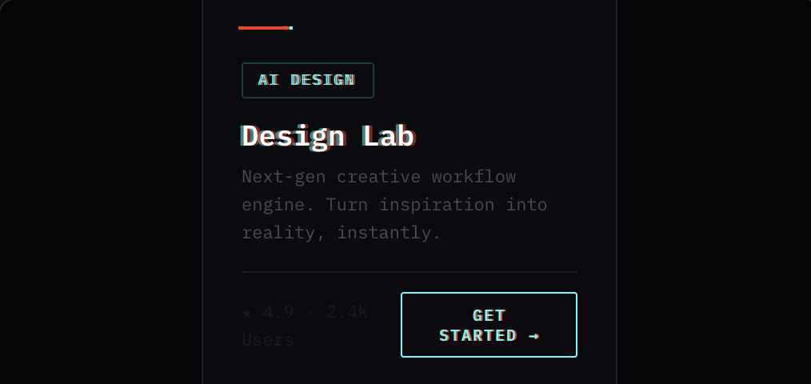</td>
<td>

<strong>54. Chromatic Aberration</strong> · <em>色差分离</em><br>
<sub>Advanced · Dark</sub>

Pure color as the primary design element — bold monochromatic or dichromatic schemes where color saturation drives the entire visual experience.

`#0A0A10` `#FF3300` `#00FFFF` `#E0E0E0`

</td>
</tr>
<tr>
<td width="260">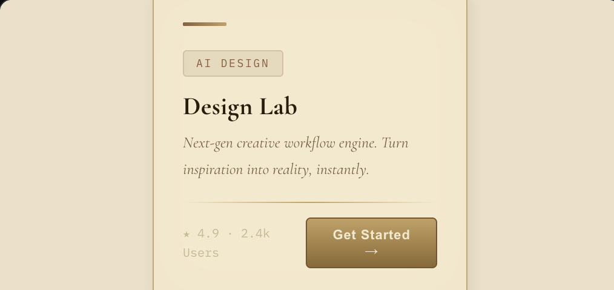</td>
<td>

<strong>55. Vintage Analog</strong> · <em>复古胶片</em><br>
<sub>Medium · Light</sub>

Aged, nostalgic aesthetic with sepia tones, distressed textures, retro typography, and the warmth of analog photography and print.

`#F5E8CC` `#C4A060` `#8B5E3C` `#3A2C18`

</td>
</tr>
<tr>
<td width="260">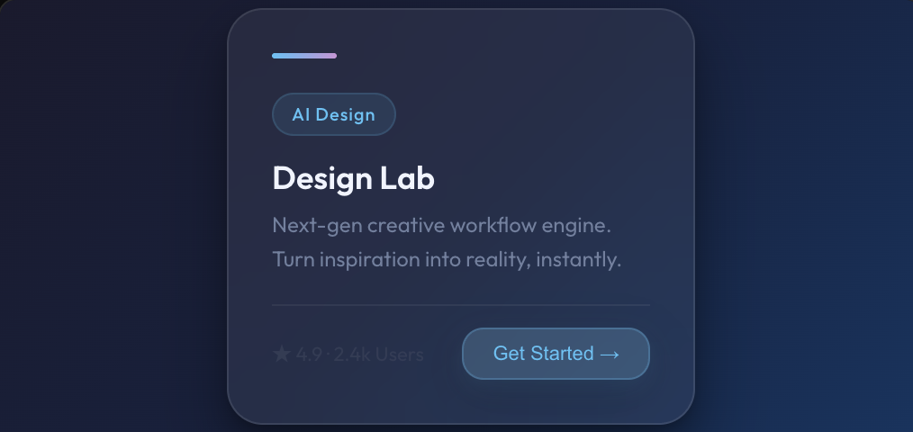</td>
<td>

<strong>56. Dimensional Layering</strong> · <em>维度层叠</em><br>
<sub>Advanced · Dark</sub>

Subtle depth through semi-transparent overlapping layers on dark backgrounds — like looking through tinted glass panes stacked in space.

`#1A1A2E` `#4FC3F7` `#CE93D8` `#E0E4F0`

</td>
</tr>
<tr>
<td width="260">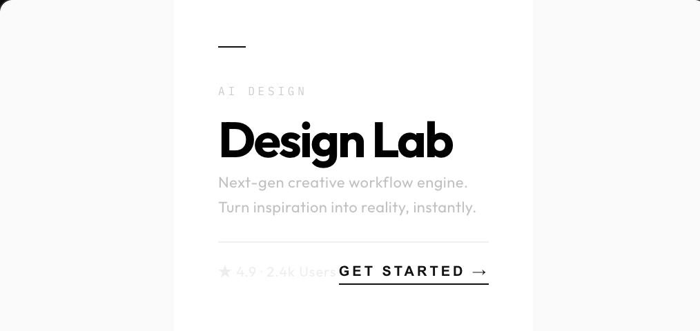</td>
<td>

<strong>57. Exaggerated Minimalism</strong> · <em>夸张极简</em><br>
<sub>Medium · Light</sub>

Extreme minimalism — nearly empty white pages with one dramatic oversized element breaking the silence. Ultra-thin lines, extreme font size contrast, zero color.

`#FFFFFF` `#000000` `#F0F0F0` `#CCCCCC`

</td>
</tr>
<tr>
<td width="260">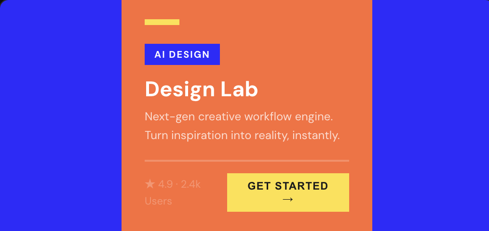</td>
<td>

<strong>58. Vibrant Block Based</strong> · <em>活力色块</em><br>
<sub>Easy · Bold · 🔥 Trend</sub>

Bold solid color blocks building page structure — each section one vivid color. No gradients, no shadows — pure chromatic collision and contrast.

`#FF6B35` `#004E89` `#FCBF49` `#2B2D42`

</td>
</tr>
<tr>
<td width="260">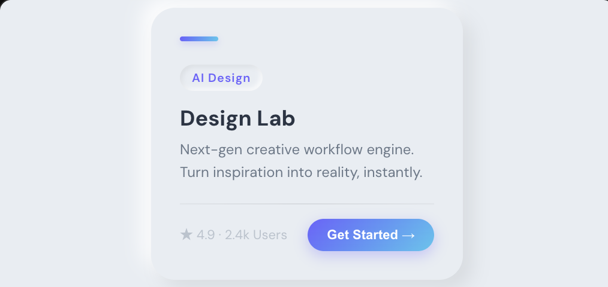</td>
<td>

<strong>59. Soft UI Evolution</strong> · <em>柔性UI进化</em><br>
<sub>Medium · Light · 🔥 Trend</sub>

Evolved neumorphism — soft inner/outer shadows with added color depth and subtle gradients. More usable than classic neumorphism, with accessible tactile feel.

`#E8EDF5` `#D1D9E6` `#F0F4FA` `#7B8794`

</td>
</tr>
<tr>
<td width="260">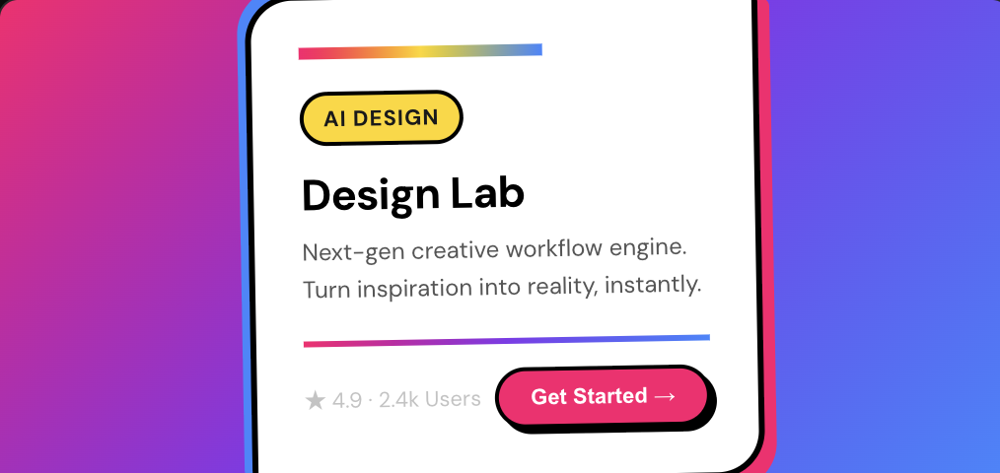</td>
<td>

<strong>60. Gen Z Chaos Maximalism</strong> · <em>Z世代混沌</em><br>
<sub>Advanced · Bold · 🔥 Trend</sub>

Designed for the TikTok generation — deliberately breaking all layout rules. Tilted text, random stickers, neon clashes, meme-style emoji mashups.

`#FF00FF` `#00FF88` `#FFE600` `#7B61FF`

</td>
</tr>
<tr>
<td width="260">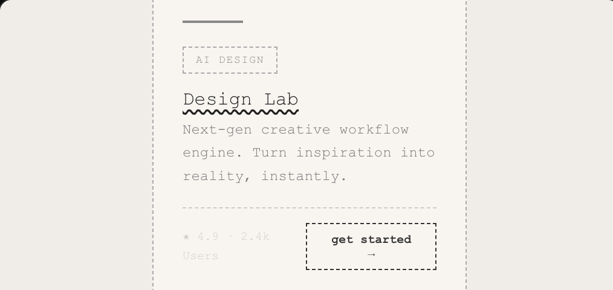</td>
<td>

<strong>61. Anti-Polish Raw</strong> · <em>反精致美学</em><br>
<sub>Medium · Bold · 🔥 Trend</sub>

Deliberately "unfinished" design — exposed code snippets, uncropped image edges, hand-drawn lines replacing precise shapes. Anti-design rebellion emphasizing authenticity.

`#F5F0EB` `#2C2C2C` `#E8DDD3` `#8B7355`

</td>
</tr>
<tr>
<td width="260">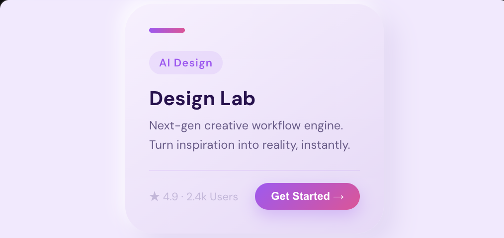</td>
<td>

<strong>62. Tactile Digital</strong> · <em>触感数字</em><br>
<sub>Medium · Light · 🔥 Trend</sub>

Making digital interfaces "touchable" — paper fibers, woven fabric textures, wood grain. Every surface has a unique tactile hint that makes you want to reach out.

`#F7F3EE` `#D4C5B2` `#8B7355` `#3D3027`

</td>
</tr>
<tr>
<td width="260">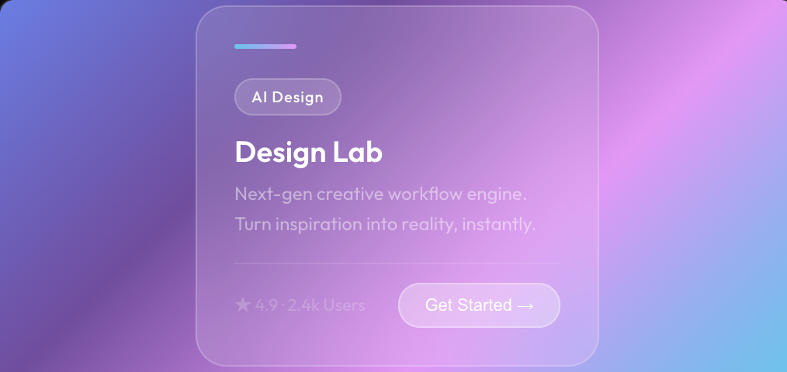</td>
<td>

<strong>63. Gradient Mesh</strong> · <em>渐变网格</em><br>
<sub>Medium · Bold · 🔥 Trend</sub>

Complex multi-point gradients with mesh overlays creating flowing, dreamy visuals. Not simple two-color gradients — colors blend naturally like wind-blown paint.

`#667EEA` `#764BA2` `#F093FB` `#4FACFE`

</td>
</tr>
<tr>
<td width="260">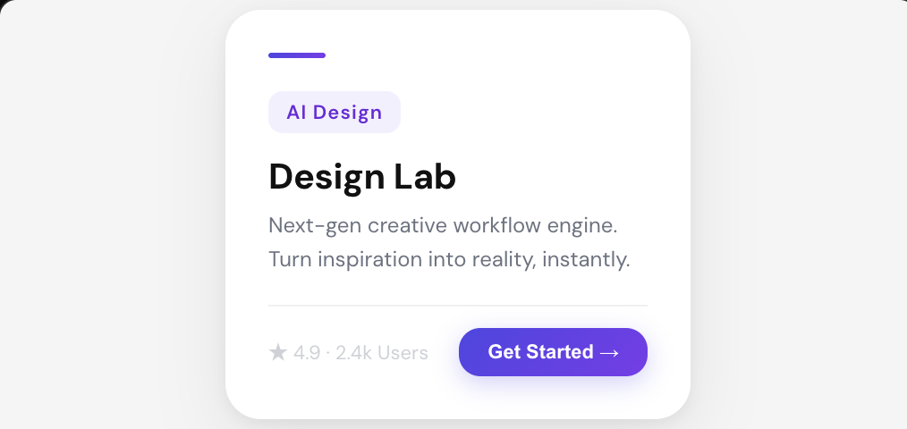</td>
<td>

<strong>64. 3D Product Preview</strong> · <em>3D产品展示</em><br>
<sub>Advanced · Bold · 🔥 Trend</sub>

Photo-realistic 3D product renders as the centerpiece — dark backgrounds highlighting reflections and shadows, floating effects emphasizing depth.

`#0A0A0A` `#1A1A2E` `#E0E0E0` `#00D4FF`

</td>
</tr>
<tr>
<td width="260">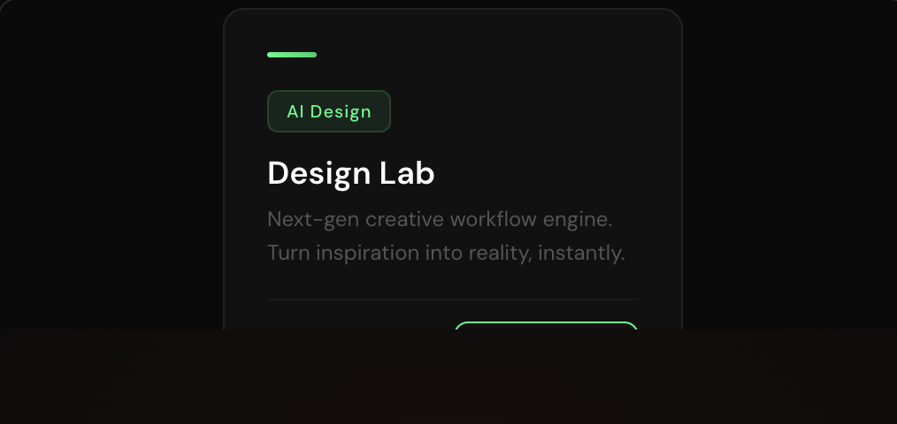</td>
<td>

<strong>65. Interactive Cursor</strong> · <em>交互光标</em><br>
<sub>Advanced · Bold · 🔥 Trend</sub>

The cursor becomes part of the design — custom shapes, follow animations, magnetic hover effects, motion trails. The whole page is an interactive playground.

`#1A1A1A` `#FFFFFF` `#FF4444` `#FFD700`

</td>
</tr>
<tr>
<td width="260">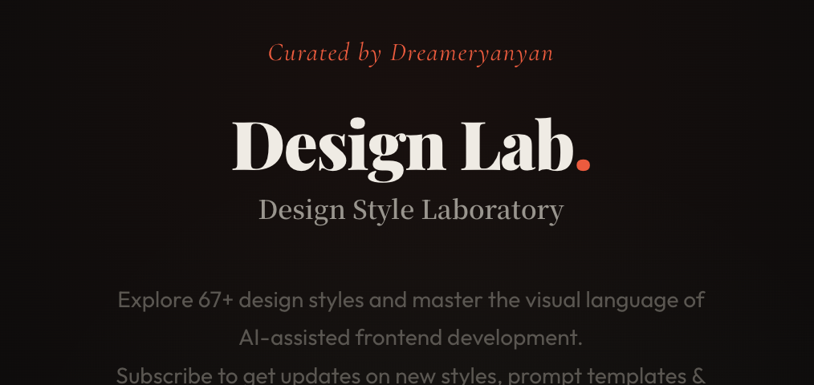</td>
<td>

<strong>66. Micro Interactions</strong> · <em>微交互</em><br>
<sub>Medium · Light · 🔥 Trend</sub>

Devil in the details — every button click, scroll event, and state change has a carefully crafted micro-animation. Skeleton screens, spring bounces, rolling numbers.

`#FAFBFC` `#24292E` `#0366D6` `#28A745`

</td>
</tr>
<tr>
<td width="260">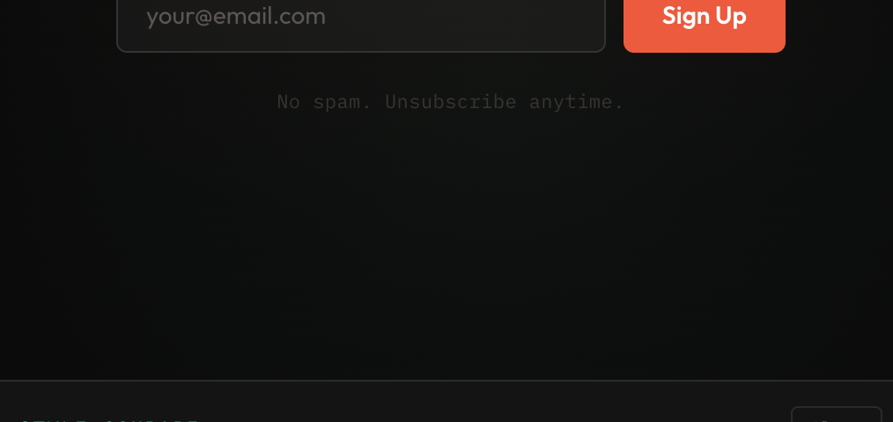</td>
<td>

<strong>67. Zero Interface</strong> · <em>零界面</em><br>
<sub>Advanced · Light · 🔥 Trend</sub>

The best interface is no interface — content IS the interface. Remove all UI chrome (navbars, sidebars, button borders) and let content speak directly.

`#FFFFFF` `#111111` `#F5F5F5` `#999999`

</td>
</tr>
</table>

Each style entry (in [`styles-reference.md`](./styles-reference.md)) includes: full color palette (7+ tokens with roles), a copy-paste CSS snippet, 3 prompt templates (Basic / Advanced / Keywords), Do's and Don'ts, DNA scores, and 3 related styles.

---

## Four principles

1. **Show, don't lecture** — Lead with concrete CSS, colors, and prompt templates. Not theory, not history lessons, not "what is design."
2. **Context-aware** — A fintech dashboard needs different styles than an indie game landing page. Recommendations are always grounded in *your* project.
3. **Opinionated** — Always 3, never 15. Explain *why* each fits your specific case, not "here are some options."
4. **Immediately actionable** — Every output is CSS variables, prompt strings, and code you can paste right now. No "explore further" homework.

---

## File structure

```
design-style-skill/
├── SKILL.md                # Entry · 4 phases (Detect / Understand / Show / Apply)
├── styles-reference.md     # The 67-style library — colors, CSS, prompts, DNA scores
└── README.md               # This file
```

The interactive companion (the visual lab you actually click through) lives at **[design-lab-yanliu.vercel.app](https://design-lab-yanliu.vercel.app/)** — that's the source of truth for the style library.

---

## How it thinks

- **Style is a shortcut for intent.** Picking "Glassmorphism" vs "Brutalism" isn't cosmetic — it declares who you are, what you value, and who you're excluding. The skill treats style choice as a positioning decision, not a decoration one.
- **3 is the right number.** One is dictatorial; 15 is decision paralysis. Three lets a user compare while still being *forced* to argue for a preference.
- **DNA scores beat category labels.** "Glassmorphism" is a label; *Roundness 3 / Contrast 2 / Warmth 2* is a coordinate. Coordinates let you swap between styles that share DNA even if the label sounds different.
- **Apply > describe.** A style is only useful when it's in the codebase. The skill's real deliverable is the moment your project starts *looking* like the style, not a paragraph about the style.

---

## Related links

- 🧪 **[design-lab-yanliu.vercel.app](https://design-lab-yanliu.vercel.app/)** — interactive 67-style lab (colors, prompts, one-click copy)
- 📚 [`styles-reference.md`](./styles-reference.md) — full library as a single Markdown reference
- 🧠 [`SKILL.md`](./SKILL.md) — the skill's routing, phases, and guardrails

---

## License

MIT — fork it, remix it, ship your own version.

Created by [Dreameryanyan](https://www.linkedin.com/in/yanliudesign/) · [LinkedIn](https://www.linkedin.com/in/yanliudesign/) · [X](https://x.com/yanliudreamer) · [Xiaohongshu](https://www.xiaohongshu.com/notification)
